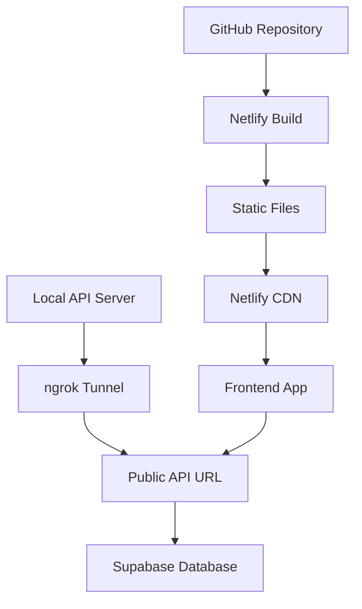

# 🚀 Deployment Status

## ✅ **СТАТУС: ГОТОВ К ДЕПЛОЮ**

**Дата последнего обновления**: 2025-09-13  
**Версия**: 1.0.0-deployment-ready

---

## 📊 **Текущее состояние**

### ✅ **Завершено**
- [x] ✅ **Проблема "Module not found" исправлена** - удалена ссылка на несуществующий пакет в `next.config.js`
- [x] ✅ **Локальная сборка проходит успешно** - `npm run build` работает без ошибок
- [x] ✅ **Код синхронизирован с GitHub** - ветка `main` содержит все исправления
- [x] ✅ **API сервер запущен** - работает на порту 3002
- [x] ✅ **ngrok туннель активен** - `https://b0be4979bb9f.ngrok-free.app`
- [x] ✅ **Monorepo конфигурация исправлена** - `netlify.toml` настроен правильно

### 🔄 **Готово к запуску**
- 🔄 **Netlify деплой** - настройки готовы, ожидает запуска
- 🔄 **Environment variables** - нужно добавить в Netlify

### ⚠️ **Требует внимания**
- ⚠️ **ngrok URL**: временный, может измениться при перезапуске
- ⚠️ **Free tier ограничения**: Netlify и Supabase на бесплатных планах

---

## 🎯 **Конфигурация деплоя**

### **GitHub Repository**
```
Repository: https://github.com/sa1to21/Finance-mini-app-vibe
Branch: main
Status: ✅ Up-to-date with fixes
```

### **Netlify Settings**
```toml
Repository: sa1to21/Finance-mini-app-vibe
Branch: main
Base directory: (empty)
Build command: npm install && cd apps/web && npm install && npm run build
Publish directory: apps/web/.next
Node version: 18.17.0
```

### **Environment Variables для Netlify**
```bash
NEXT_PUBLIC_API_URL=https://b0be4979bb9f.ngrok-free.app
NODE_ENV=production
```

---

## 🏗️ **Архитектура деплоя**



### **Frontend (Static)**
- **Платформа**: Netlify
- **Содержимое**: `apps/web/` (Next.js app)
- **Деплой**: Автоматический при push в `main`
- **URL**: Будет назначен Netlify

### **Backend (Dynamic)**
- **Сервер**: Локальный (порт 3002)
- **API**: Fastify + Supabase
- **Публичный доступ**: ngrok туннель
- **URL**: `https://b0be4979bb9f.ngrok-free.app`

---

## 🔧 **Исправленные проблемы**

### ❌ **Issue #1: "Module not found" для UI компонентов**

**Причина**: Ссылка на несуществующий пакет `@finance-tracker/ui` в `next.config.js`

**Решение**:
```javascript
// Было
const nextConfig = {
  transpilePackages: ['@finance-tracker/ui'], // ← Проблема
  // ...
}

// Стало
const nextConfig = {
  // transpilePackages убрано
  // ...
}
```

**Результат**: ✅ Локальная сборка успешна, готов к Netlify

---

## 📋 **Чеклист для деплоя**

### **Pre-deployment**
- [x] Локальная сборка работает
- [x] TypeScript проверки проходят
- [x] ESLint без ошибок
- [x] API сервер запущен
- [x] ngrok туннель активен
- [x] Код в GitHub актуален

### **Deployment**
- [ ] Создать новый сайт в Netlify
- [ ] Подключить GitHub репозиторий
- [ ] Настроить переменные окружения
- [ ] Запустить первый деплой
- [ ] Проверить функциональность

### **Post-deployment**
- [ ] Протестировать все основные функции
- [ ] Проверить интеграцию с Telegram
- [ ] Убедиться в работе API
- [ ] Задокументировать production URL

---

## 🚨 **Важные моменты**

### **ngrok Ограничения**
- 🕐 **Время сессии**: ограничено
- 🔄 **URL изменяется**: при каждом перезапуске
- ⚡ **Требует обновления**: переменной `NEXT_PUBLIC_API_URL` в Netlify

### **Supabase**
- 💾 **Free tier**: 500MB БД, 50MB файлов
- 🔐 **RLS активен**: безопасность настроена
- 📊 **Все таблицы**: созданы и заполнены тестовыми данными

### **Netlify**
- 🌐 **Free tier**: 100GB трафика/месяц
- ⚡ **Build time**: 300 минут/месяц
- 🔄 **Auto-deploy**: при push в main

---

## 🎯 **Следующие шаги**

1. **Запустить Netlify деплой**
   ```bash
   # В Netlify Dashboard:
   # New site from Git → GitHub → sa1to21/Finance-mini-app-vibe
   ```

2. **Добавить environment variables**
   ```bash
   NEXT_PUBLIC_API_URL=https://b0be4979bb9f.ngrok-free.app
   NODE_ENV=production
   ```

3. **Протестировать деплой**
   - Открыть Netlify URL
   - Проверить работу API
   - Тестировать в Telegram

4. **Настроить Telegram bot**
   - Обновить Web App URL в BotFather
   - Протестировать в реальном Telegram

---

## 📞 **Support & Troubleshooting**

### **Если деплой не удался**
1. Проверить логи в Netlify Dashboard
2. Убедиться что все environment variables установлены
3. Проверить что ngrok туннель активен
4. Открыть issue в [DEPLOYMENT_ISSUES.md](./DEPLOYMENT_ISSUES.md)

### **Если API недоступен**
1. Проверить статус ngrok туннеля
2. Перезапустить API сервер (`cd apps/api && npm run dev`)
3. Обновить URL в Netlify environment variables

---

**🎉 Проект готов к production деплою!**

**Документация**: Все проблемы задокументированы в [DEPLOYMENT_ISSUES.md](./DEPLOYMENT_ISSUES.md)  
**GitHub**: https://github.com/sa1to21/Finance-mini-app-vibe  
**Статус**: ✅ Production Ready